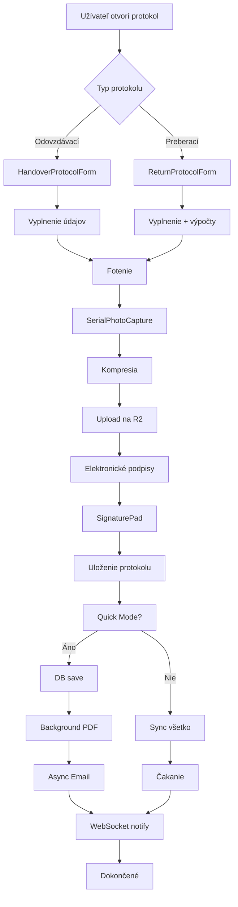

# 📋 DETAILNÁ ANALÝZA SEKCIE PROTOKOLY - BlackRent

## 🎯 Prehľad systému protokolov

Sekcia protokoly v BlackRent systéme je komplexný modul pre správu odovzdávacích a preberacích protokolov pri prenájme vozidiel. Systém umožňuje kompletné zdokumentovanie stavu vozidla, vrátane fotografií, videí, elektronických podpisov a automatického generovania PDF dokumentov.

---

## 📊 Architektúra systému

### Frontend komponenty:
1. **HandoverProtocolForm** (`/src/components/protocols/HandoverProtocolForm.tsx`)
   - Formulár pre vytvorenie odovzdávacieho protokolu
   - 1240 riadkov kódu s optimalizáciami pre mobile

2. **ReturnProtocolForm** (`/src/components/protocols/ReturnProtocolForm.tsx`)
   - Formulár pre vytvorenie preberacieho protokolu
   - 1012 riadkov kódu s automatickými výpočtami poplatkov

3. **SerialPhotoCapture** (`/src/components/common/SerialPhotoCapture.tsx`)
   - Univerzálny komponent pre zachytávanie fotografií a videí
   - Podpora WebP, kompresie a priameho uploadu na R2

### Backend služby:
1. **Protokol API** (`/backend/src/routes/protocols.ts`)
   - REST API endpointy pre správu protokolov
   - WebSocket notifikácie pre real-time aktualizácie

2. **R2 Storage** (`/backend/src/utils/r2-storage.ts`)
   - Integrácia s Cloudflare R2 pre ukladanie súborov
   - Organizovaná štruktúra priečinkov

3. **Email Service** (`/backend/src/services/email-service.ts`)
   - Automatické odosielanie protokolov emailom
   - HTML šablóny s PDF prílohami

---

## 🔄 Tok dát pri vytváraní protokolu

### 1️⃣ **ODOVZDÁVACÍ PROTOKOL (Handover Protocol)**

#### Krok 1: Vyplnenie formulára
```typescript
// Povinné polia:
- Miesto prevzatia (location)
- Stav tachometra (odometer)
- Úroveň paliva (fuelLevel)
- Spôsob úhrady depozitu (depositPaymentMethod)
- Elektronické podpisy (customer + employee)
```

#### Krok 2: Zachytávanie médií
```typescript
// Typy fotografií:
- vehicle: Fotky vozidla (exteriér/interiér)
- document: Dokumenty (TP, vodičák)
- damage: Poškodenia (ak existujú)
- odometer: Fotka tachometra
- fuel: Fotka palivomera

// Proces:
1. Užívateľ klikne na tlačidlo fotenia
2. Otvorí sa SerialPhotoCapture komponent
3. Možnosti:
   - Natívna kamera (prehliadač)
   - Upload z galérie
   - Video nahrávanie
4. Automatická kompresia (WebP ak podporované)
5. Upload na R2 storage
```

#### Krok 3: Elektronické podpisy
```typescript
// SignaturePad komponent:
- Canvas pre kreslenie podpisu
- Časová pečiatka (timestamp)
- GPS lokácia (ak povolené)
- Uloženie ako base64 obrázok
```

#### Krok 4: Uloženie protokolu
```typescript
// Quick Mode (odporúčané):
1. Okamžité uloženie do databázy
2. PDF generovanie na pozadí
3. Email odosielanie asynchrónne
4. WebSocket notifikácia

// Standard Mode:
1. Synchronné spracovanie všetkého
2. Čakanie na PDF a email
3. Potvrdenie úspešnosti
```

---

### 2️⃣ **PREBERACÍ PROTOKOL (Return Protocol)**

#### Automatické výpočty:
```typescript
// Výpočet poplatkov:
const kilometersUsed = currentOdometer - startingOdometer;
const kilometerOverage = max(0, kilometersUsed - allowedKilometers);
const kilometerFee = kilometerOverage * extraKmRate;

// Palivo:
const fuelUsed = startingFuel - currentFuel;
const fuelFee = fuelUsed * 0.02; // 2 centy za %

// Finálny výpočet:
const totalExtraFees = kilometerFee + fuelFee;
const depositRefund = max(0, deposit - totalExtraFees);
```

#### Editácia ceny za km:
- Možnosť upraviť cenníkovú sadzbu
- Vizuálne zobrazenie prepočtu
- Uloženie do poznámok protokolu

---

## 💾 Ukladanie fotografií na R2

### Organizačná štruktúra:
```
/2025/01/BlackRent/BMW_X5_BA123AB/handover/{protocol-id}/
  ├── vehicle_photos/
  │   ├── exterier_front.webp
  │   ├── exterier_back.webp
  │   └── interier_dashboard.webp
  ├── documents/
  │   ├── technicak.jpg
  │   └── vodicsky_preukaz.jpg
  ├── damages/
  │   └── skrabance_dvere.webp
  ├── signatures/
  │   ├── customer_signature.png
  │   └── employee_signature.png
  └── pdf/
      └── Odovzdavaci_Jan_Novak_BMW_BA123AB_2025-01-15.pdf
```

### Proces uploadu:

#### 1. Frontend - Presigned URL:
```typescript
// SerialPhotoCapture.tsx
const uploadToR2 = async (file: File) => {
  // 1. Získanie presigned URL
  const presignedResponse = await fetch('/api/files/presigned-upload', {
    method: 'POST',
    body: JSON.stringify({
      protocolId: entityId,
      filename: file.name,
      contentType: file.type,
      fileSize: file.size,
      category: 'vehicle_photos'
    })
  });
  
  const { uploadUrl, finalUrl } = await presignedResponse.json();
  
  // 2. Priamy upload na R2
  await fetch(uploadUrl, {
    method: 'PUT',
    body: file,
    headers: {
      'Content-Type': file.type
    }
  });
  
  return finalUrl;
};
```

#### 2. Backend - Generovanie URL:
```typescript
// r2-storage.ts
async createPresignedUploadUrl(key: string, contentType: string) {
  const command = new PutObjectCommand({
    Bucket: 'blackrent-storage',
    Key: key,
    ContentType: contentType,
  });
  
  return await getSignedUrl(this.client, command, { 
    expiresIn: 3600 // 1 hodina
  });
}
```

### Kompresia obrázkov:
```typescript
// imageCompression.ts
const QUALITY_PRESETS = {
  mobile: { maxWidth: 1024, quality: 0.7 },
  protocol: { maxWidth: 1920, quality: 0.85 },
  highQuality: { maxWidth: 2560, quality: 0.92 },
  archive: { maxWidth: 4096, quality: 0.95 }
};

// WebP ak podporované
if (await isWebPSupported()) {
  return await compressToWebP(image, preset);
}
```

---

## 📧 Email systém

### Konfigurácia SMTP (Websupport):
```env
SMTP_HOST=smtp.m1.websupport.sk
SMTP_PORT=465
SMTP_SECURE=true
SMTP_USER=info@blackrent.sk
SMTP_PASS=***
EMAIL_SEND_PROTOCOLS=true
```

### Email šablóna:
```typescript
// email-service.ts
async sendHandoverProtocolEmail(customer, pdfBuffer, protocolData) {
  const mailOptions = {
    from: 'BlackRent System <info@blackrent.sk>',
    to: customer.email,
    cc: 'objednavky@blackrent.sk', // Automatická kópia
    subject: `Odovzdávací protokol - ${vehicle.licensePlate}`,
    html: generateHTMLTemplate(protocolData),
    attachments: [{
      filename: `protokol_${orderNumber}.pdf`,
      content: pdfBuffer,
      contentType: 'application/pdf'
    }]
  };
  
  return await transporter.sendMail(mailOptions);
}
```

---

## 🗄️ Databázová schéma

### Tabuľka: `handover_protocols`
```sql
- id (UUID, PRIMARY KEY)
- rental_id (UUID, FOREIGN KEY)
- location (TEXT)
- vehicle_condition (JSONB)
  - odometer
  - fuelLevel
  - fuelType
  - exteriorCondition
  - interiorCondition
- vehicle_images (JSONB[])
- document_images (JSONB[])
- damage_images (JSONB[])
- signatures (JSONB[])
- rental_data (JSONB) - snapshot údajov
- pdf_url (TEXT)
- email_sent (BOOLEAN)
- created_by (TEXT)
- created_at (TIMESTAMP)
```

### Tabuľka: `return_protocols`
```sql
- id (UUID, PRIMARY KEY)
- rental_id (UUID, FOREIGN KEY)
- handover_protocol_id (UUID, FOREIGN KEY)
- location (TEXT)
- vehicle_condition (JSONB)
- kilometers_used (INTEGER)
- kilometer_overage (INTEGER)
- kilometer_fee (DECIMAL)
- fuel_used (INTEGER)
- fuel_fee (DECIMAL)
- total_extra_fees (DECIMAL)
- deposit_refund (DECIMAL)
- [... ostatné polia podobné ako handover]
```

---

## ⚡ Optimalizácie a vylepšenia

### 1. Mobile optimalizácie:
- Lazy loading komponentov
- Memoizácia heavy výpočtov
- Touch-friendly UI
- Keyboard shortcuts (Space = rýchle foto)

### 2. Quick Mode:
- Okamžité uloženie (< 500ms)
- Background PDF generovanie
- Asynchrónne email odosielanie
- Real-time WebSocket notifikácie

### 3. Smart Caching:
```typescript
// protocolFormCache.ts
const smartDefaults = getSmartDefaults(companyName);
// Zapamätá si často používané hodnoty:
- location (posledné miesto)
- fuelLevel (väčšinou 100%)
- depositPaymentMethod
```

### 4. Error Recovery:
- Auto-save do sessionStorage
- Retry mechanizmus pre upload
- Fallback na base64 ak R2 zlyhá

---

## 🔐 Bezpečnosť

### 1. Autentifikácia:
- JWT tokeny pre API volania
- Bearer token pre R2 presigned URLs

### 2. Validácia:
- Povinné polia na frontende
- Backend validácia pred uložením
- UUID validácia pre IDs

### 3. Zálohovanie:
- PDF kópie na R2
- Email kópie zákazníkom
- Databázové zálohy

---

## 📊 Štatistiky a monitoring

### WebSocket events:
```typescript
// Broadcast pri vytvorení protokolu
websocketService.broadcastProtocolCreated(
  rentalId, 
  protocolType, 
  protocolId, 
  userName
);
```

### Bulk API pre dashboard:
```typescript
// Získanie stavu protokolov pre všetky prenájmy
GET /api/protocols/bulk-status
// Vracia: { rentalId, hasHandover, hasReturn }
```

---

## 🚀 Workflow diagram



---

## 📝 Záver

Systém protokolov v BlackRent je **robustné a komplexné riešenie** pre dokumentáciu prenájmov vozidiel. Kombinuje moderné technológie (React, TypeScript, R2 Storage) s praktickými funkciami (elektronické podpisy, automatické výpočty, email notifikácie).

### Kľúčové výhody:
✅ **Kompletná digitalizácia** - žiadne papierové protokoly  
✅ **Cloudové úložisko** - bezpečné ukladanie na R2  
✅ **Automatizácia** - PDF generovanie a email odosielanie  
✅ **Mobile-first** - optimalizované pre telefóny  
✅ **Real-time** - WebSocket notifikácie  
✅ **Audit trail** - kompletná história zmien  

### Odporúčania do budúcnosti:
1. 📱 Natívna mobilná aplikácia
2. 🔍 OCR pre automatické čítanie tachometra
3. 🤖 AI detekcia poškodení z fotografií
4. 📊 Pokročilé reporty a analytika
5. 🌍 Multi-language podpora

---

*Dokument vytvorený: 15.1.2025*  
*Verzia systému: BlackRent v2.0*