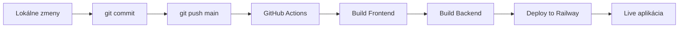

# 🚀 Automatické Nasadenie na Railway

## Nastavenie GitHub Actions pre automatické nasadenie

### 1. Nastavenie Railway Token

1. Choďte na [Railway.app](https://railway.app)
2. Kliknite na profil → Account Settings
3. Vyberte "Tokens" 
4. Vytvorte nový token s názvom "GitHub Actions"
5. Skopírujte token

### 2. Nastavenie GitHub Secrets

1. Choďte na GitHub repository → Settings → Secrets and variables → Actions
2. Kliknite "New repository secret"
3. Name: `RAILWAY_TOKEN`
4. Value: vložte token z Railway
5. Kliknite "Add secret"

### 3. Overenie Service Name

1. V Railway.app si pozrite názov service (pravdepodobne "blackrent-app")
2. Ak je iný, upravte v `.github/workflows/railway-deploy.yml` riadok:
   ```yaml
   railway up --service YOUR_SERVICE_NAME
   ```

### 4. Aktivácia

Po nastavení:
- Každý push do `main` branch spustí automatické nasadenie
- Môžete sledovať progress v GitHub Actions tab
- Deployment prebehne cez Railway automaticky

### 5. Manuálne nasadenie (backup)

Ak potrebujete manuálne nasadiť:

```bash
cd railway-blackrent
railway login
railway up
```

## Diagnostika Problémov

### Častých chýb:

1. **Railway Token expired** - Vytvorte nový token
2. **Service not found** - Skontrolujte názov service v Railway
3. **Build failed** - Skontrolujte dependencies a build scripts
4. **Git not pushed** - Commit a push zmien do main branch

### Logy nasadenia:

- GitHub Actions: repository → Actions tab
- Railway: project → Deployments tab

## Výhody Automatického Nasadenia

✅ **Žiadne manuálne kroky** - automaticky sa nasadí po push  
✅ **Vždy aktuálne** - produkcia je synchronizovaná s kódom  
✅ **História nasadení** - možnosť rollback cez Railway  
✅ **Rýchle opravy** - fix → commit → push → live  

## Workflow



Po nastavení bude každá zmena automaticky nasadená na produkciu! 